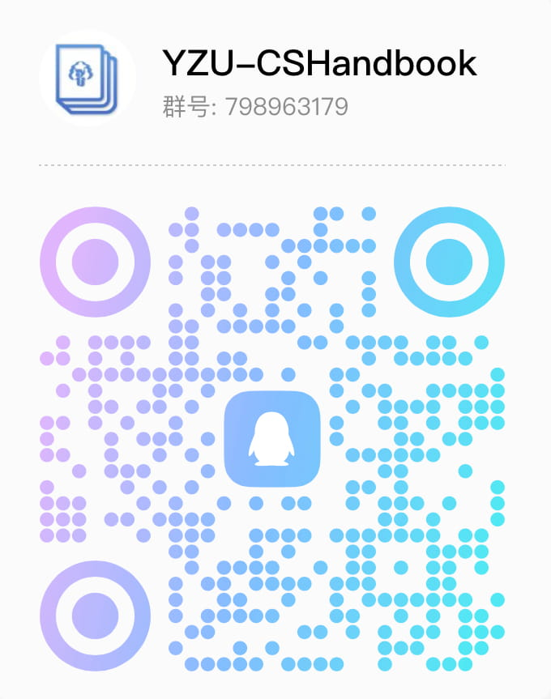

<p align="center">
  
  <h1 align="center">YZU-CSHandbook</h1>
</p>
<p align="center">扬州大学计算机科学与技术新生入门手册</p>

<p align="center">
  <a href="http://yzu.lovir.cn/"></a>
  
  =18-darkgreen?label=Node">
  
  
  <a href="http://qm.qq.com/cgi-bin/qm/qr?_wv=1027&k=uWzaGe1SmHX9ehJpXIDxNIQLOJ4dzSk-&authKey=Pz2FZ0YZ3cJABBnz2AuVYGv%2BD0MCstbafXwJ%2FYdyM%2FlNIUR2TAa5%2F%2FXFScd9Y3Pt&noverify=0&group_code=798963179"></a>
</p>

YZU-CSHandbook 是一个旨在分享大学学习经验的公益项目，为 YZU 计科学子量身打造 ( 其他学校也可适当参考 )。是本人与其他开发者们结合大学期间所学知识加以提炼而成，对本校学生具有高度参考价值，覆盖了从电脑选购到课程资攻略等一系列内容，同时也有学长学姐的经验分享，可以作为初入校园新生的参考书，以便对于计科专业有更好的认识，知道"在什么时间该做什么事"，以及如何合理的利用现有资源。


## 灵感

本项目的灵感来源于 [CS 自学指南](https://csdiy.wiki)（真的是一个很不错的教程！强烈建议广大新生阅读）

大学期间的我总是在摸黑前进，由于消息的闭塞，错失了不少珍贵的资源。我时常会想，如果当时有一个人来告诉我，学校可以申请到免费的教育邮箱、可以申请 1T 的免费云盘、可以利用自己的学生身份获得一台免费的云服务器，亦或是哪门课不值得去选...那么也许我会在大学的学习生活中更加游刃有余。太多的机会没有在恰当的时间被抓住，可是世上没有"早知道"。种下一颗树最好的时间是十年前，其次是现在。

因雨淋心悟，愿为人撑伞。因此，我创建此项目以帮助那些和我一样困境的同学，希望可以成为你们的灯塔，来指引大学的学习生活。

## 开发

我们非常欢迎广大同学为本项目贡献文章或加入一些自己的想法，请参考以下使用方法并提交 Pull Request

```bash
# node >= 18.0.0

# fork 本项目并克隆到本地
git clone https://github.com/Lovirr/YZU-CSHandbook.git

# 安装依赖
npm install

# 运行
npm run docs:dev

# 打包
npm run docs:build
```

## 交流群

<details>
<summary>如果你想获取最新通知、参与开发，请加入讨论群：<a href="http://qm.qq.com/cgi-bin/qm/qr?_wv=1027&k=uWzaGe1SmHX9ehJpXIDxNIQLOJ4dzSk-&authKey=Pz2FZ0YZ3cJABBnz2AuVYGv%2BD0MCstbafXwJ%2FYdyM%2FlNIUR2TAa5%2F%2FXFScd9Y3Pt&noverify=0&group_code=798963179)">798963179 </a></summary>
<br>

</details>

## 开源许可

Released under the [MIT](./LICENSE) License, Copyright © 2023-present Lovir
